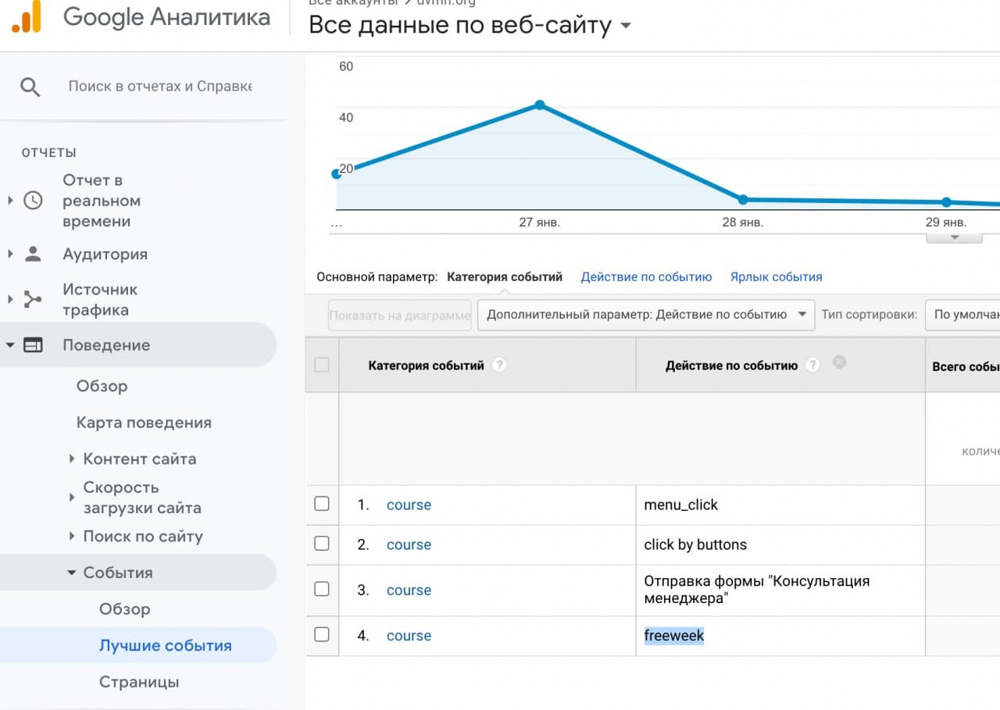
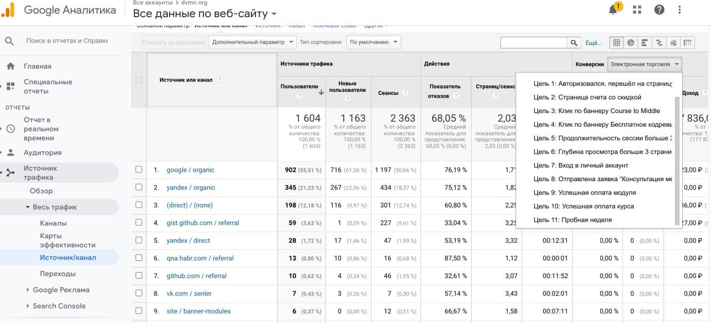
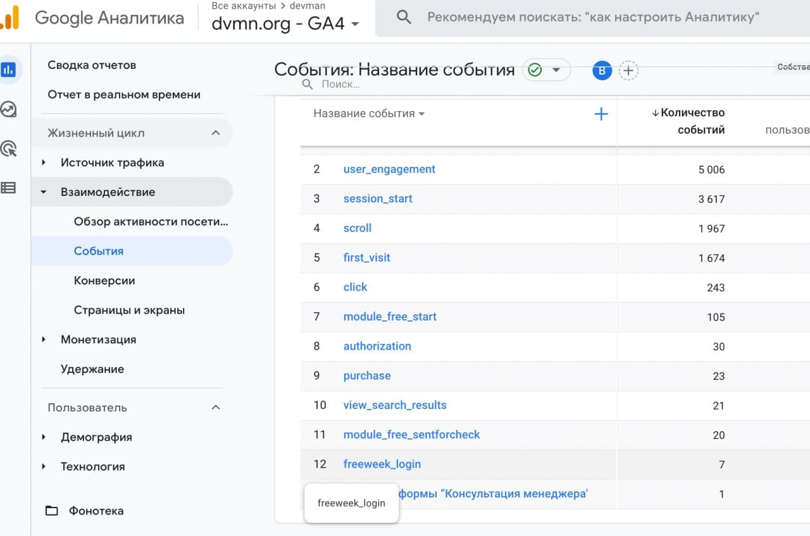

# Как проверить создаются ли события в GA4 и GAU после запуска скрипта

- В Google Analytics Universal искать событие под категорией **course**, действие по событию - **freeweek**

   

   Для упрощения добавлена новая цель **Пробная неделя**

   

- В Google Analytics 4 смотреть в отчете по событиям **freeweek_login**

   