# Инструкция по запуску и настройке скриптов

## Как запустить local-версию

Для запуска скрипта у вас уже должен быть установлен Python 3.

- Скачайте код
- Установите зависимости командой 
    ```shell-session
    $ pip install -r requirements.txt
    ```
- Запустите оба скрипта:
    ```shell-session
    $ python3 tracking.py
    $ python3 monitoring.py
    ```

## Переменные окружения

Часть настроек проекта берётся из переменных окружения. 
Чтобы их определить, создайте файл `.env` рядом с `main.py` 
и запишите туда данные в таком формате: `ПЕРЕМЕННАЯ=значение`.

Используются следующие переменные окружения:
1) `API_SECRET` - секретный ключ MEASUREMENT PROTOCOL API вашего аккаунта GA4. 
Секретный ключ генерируется в интерфейсе Google Analytics. Получить его можно следующим образом:

   * Перейдите в раздел **Администратор - Потоки данных**:

      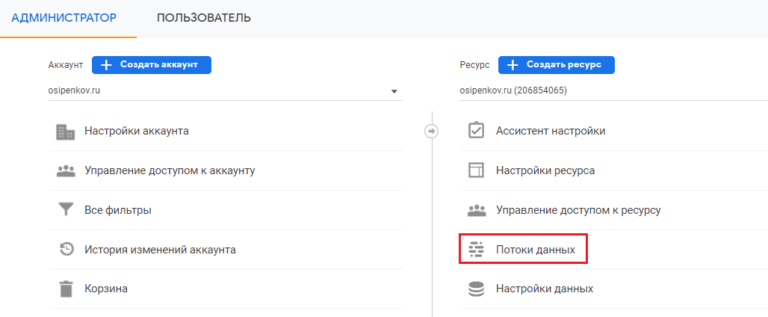

   * Выберите свой веб-поток. Затем откройте раздел **О Mesurement Protocol API**:

      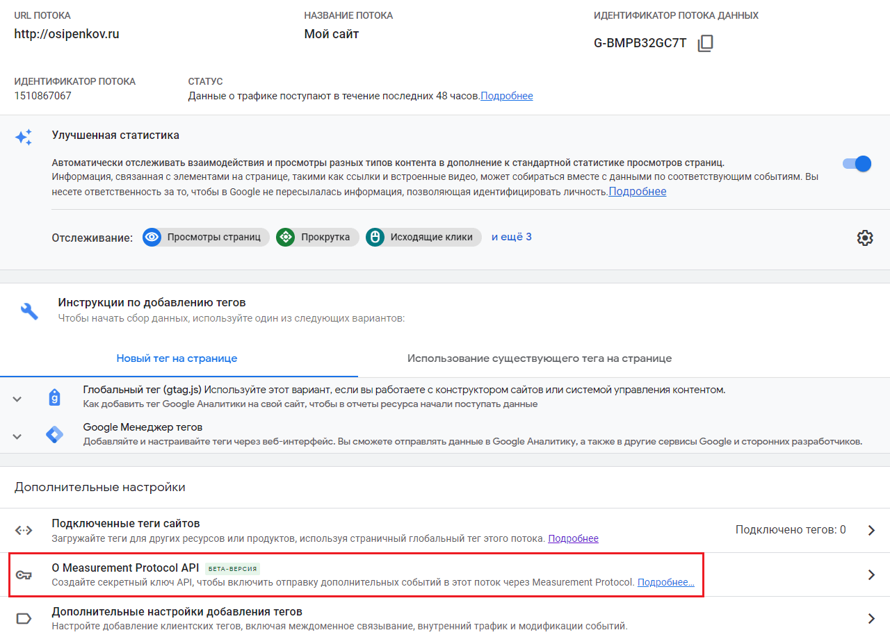

   * В открывшемся окне нажмите кнопку **Создать**:

      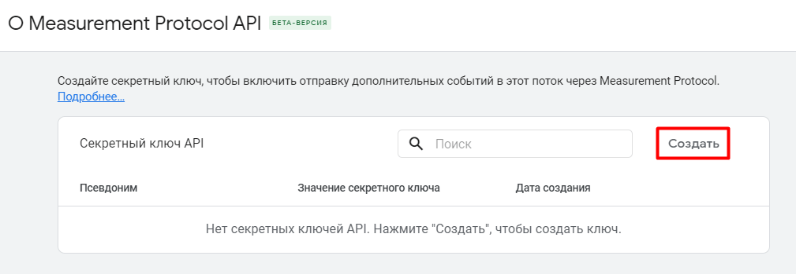

   * После ввода псевдонима нажмите кнопку **Создать**:

      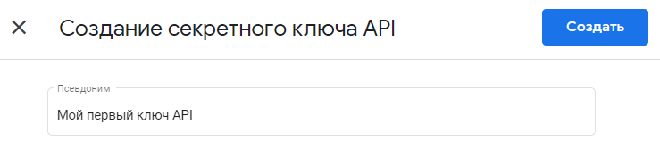

   * После создания ключа он отобразится в списке доступных в столбце **Значение секретного ключа**:

      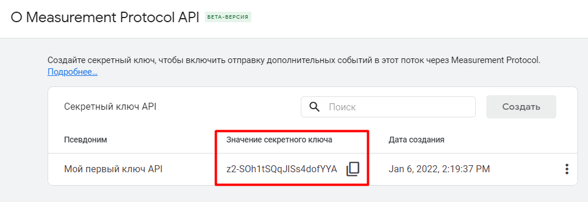

2) `MEASUREMENT_ID` - идентификатор потока данных в GA4. Чтобы найти идентификатор потока данных Google Analytics 4:

   * Перейдите в раздел **Администратор - Потоки данных**:

      

   * Выберите свой веб-поток данных:

      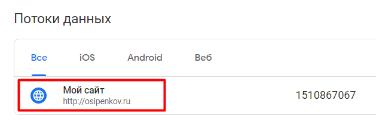

   * В открывшемся окне скопируйте значение, указанное в правом верхнем углу в 
поле **Идентификатор потока данных**:

      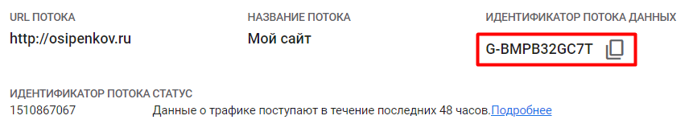
      
      Это и есть ваш идентификатор отслеживания Google Analytics 4

3) `TID` - идентификатор отслеживания в GAU
Чтобы найти идентификатор отслеживания Google Analytics Universal:

   * Перейдите в раздел **Отслеживание - Код отслеживания**:

      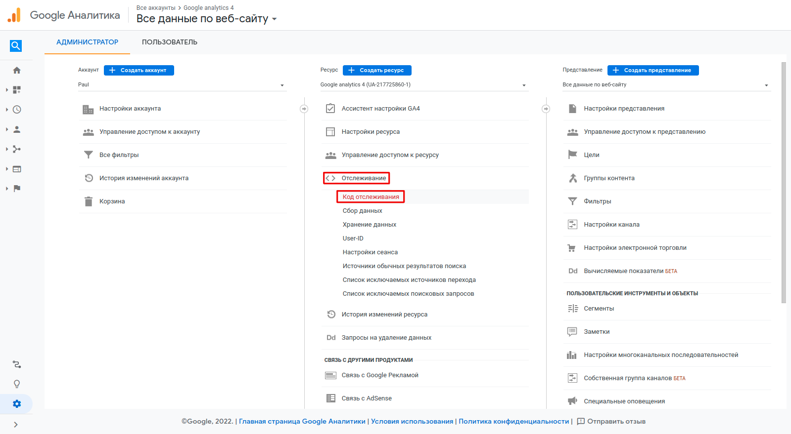

   * В открывшемся окне в графе **Идентификатор отслеживания** и есть ваш 
идентификатор отслеживания Google Analytics Universal:

      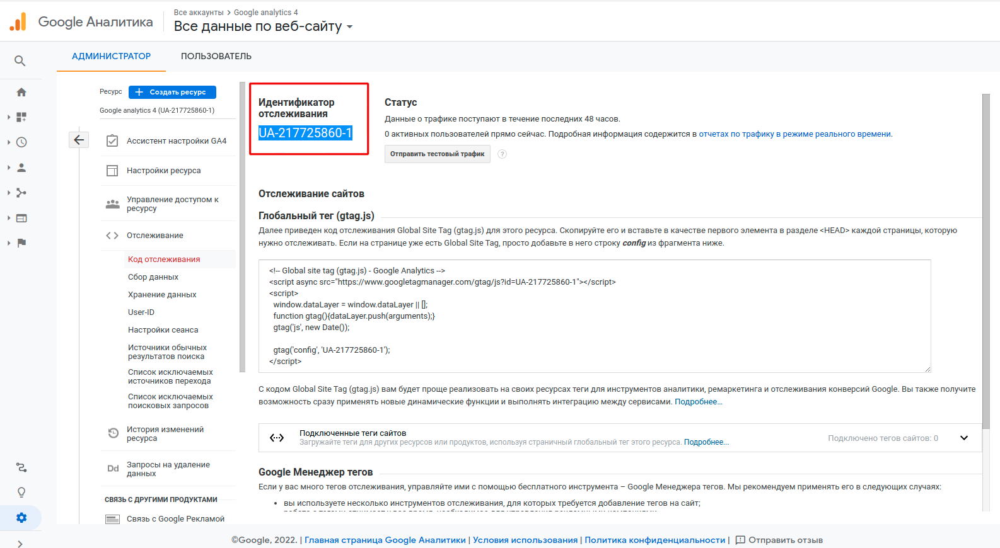

4) `SPREADSHEET_ID` - id Google-таблицы, берется прямо из url-ссылки на таблицу:

      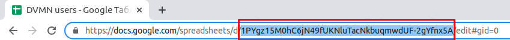

5) `CREDENTIALS_FILE` - переменная, в которой указан путь к json-файлу. 
В этом файле лежат данные сервисного аккаунта, через который идет 
взаимодействие с Google Drive API. Для его получения: 

   * Перейдите по [ссылке](https://console.cloud.google.com/cloud-resource-manager)

   * Нажмите **Create Project**:

      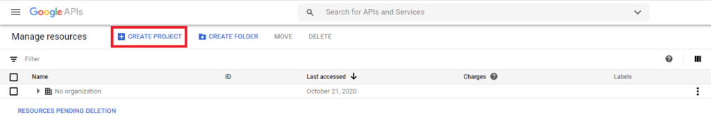

   * Введите название проекта и нажмите **Create**:

      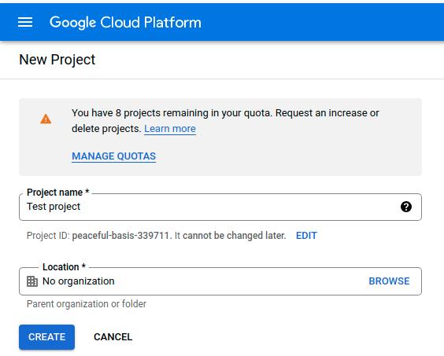

   * Перейдите в **Dashboard** созданного проекта:

      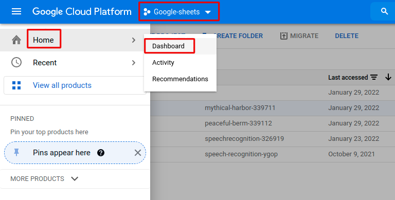

   * В разделе APIs нажмите **Go to APIs overview**:

      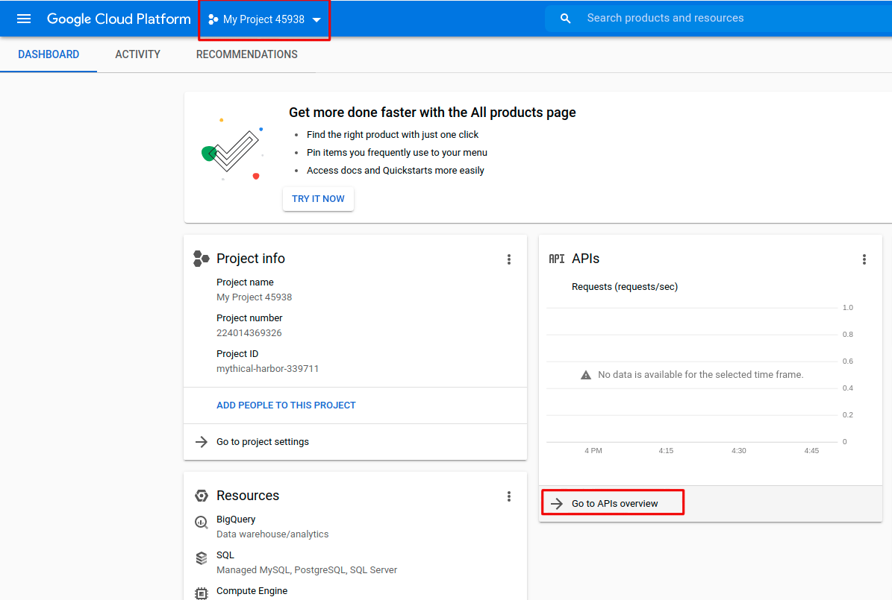

   * Нажмите **ENABLE APIS AND SERVICES**:

      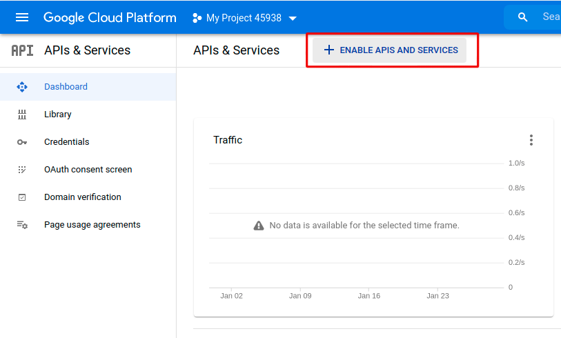

   * Необходимо подключить 2 АПИ: **Google Sheets API**  и **Google Drive API**.
В поисковом окне напишите **Google Sheets API**, после чего нажмите на **ENABLE**

   * Затем вернитесь в это же поисковое окно, и напишите **Google Drive API**, после чего нажмите на **ENABLE**:

      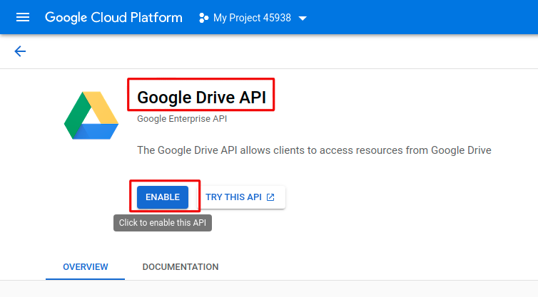

   * Далее необходимо создать сервисный аккаунт. В открывшемся окне нажмите **CREATE CREDENTIALS**:

      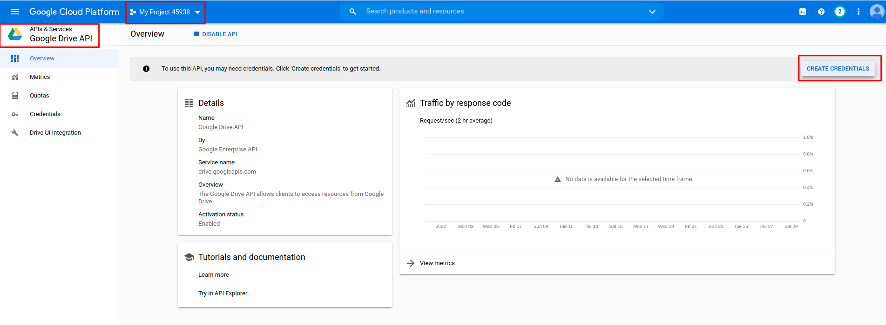

   * Заполните данные как на картинке, после чего нажмите **NEXT**:

      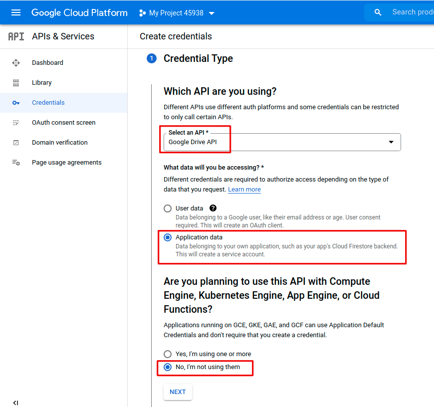

   * Напишите имя сервисного аккаунта, после чего нажмите **CREATE AND CONTINUE**:

      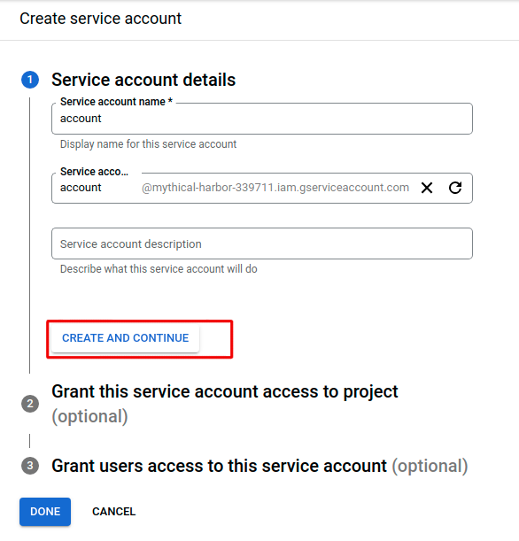

   * Добавьте роль, нажмите **Role-Project-Editor**:

      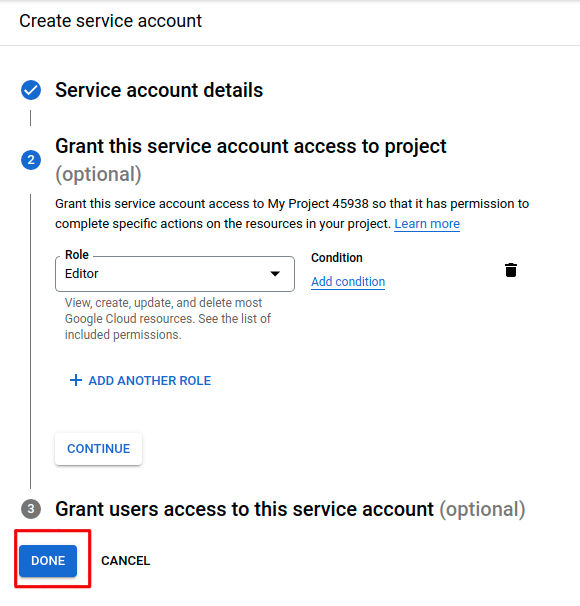

      Далее нажмите **DONE**

   * В открывшемся окне нажмите на ваш только что созданный сервисный аккаунт:

      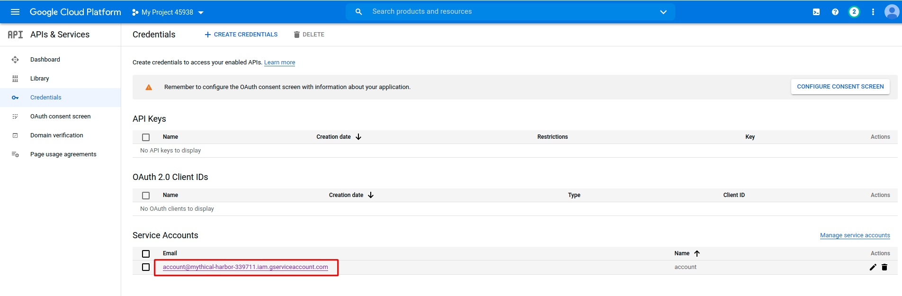

   * Далее перейдите во вкладку **KEYS**, далее **ADD KEY - Create new key**.  В открывшемся окне выберите JSON и нажмите CREATE. Далее загрузите себе этот файл.

      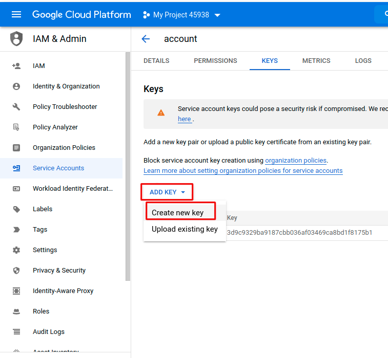

   * В скачанном json файле в ключе **client_email** будет аккаунт, которому нужно будет предоставить доступ в вашей Google-таблице:

      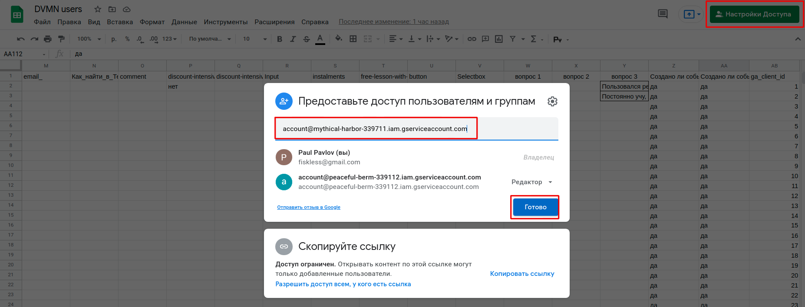


6) `ROLLBAR_ACCESS_TOKEN` - токен для доступа к [Rollbar](https://rollbar.com/)
7) `ENVIRONMENT` - настройка для Rollbar, группирует события по названию окружения local/dev/production/etc. При 
разработке на своей машине поставьте значение `local`, на боевом сервере - `production`.